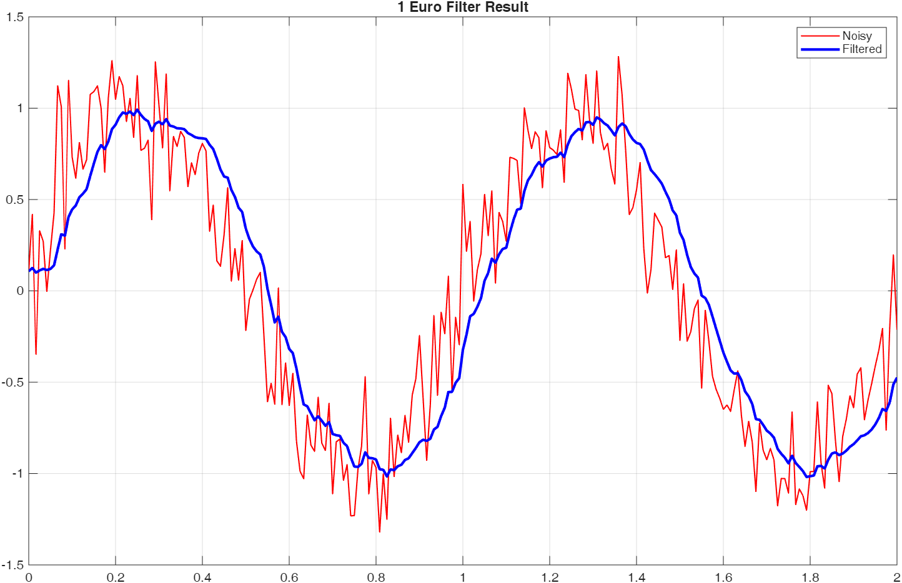

# OneEuroFilter MATLAB Implementation

[](https://www.mathworks.com/matlabcentral/fileexchange/183059-oneeurofilter)
[](https://matlab.mathworks.com/open/github/v1?repo=cuixing158/OneEuroFilter&file=ExampleOneEuroFilter)

A MATLAB implementation of the **1 Euro Filter**[^1], a simple algorithm for filtering noisy signals for high precision and responsiveness.

:hugs: Happy Filtering!

## Introduction

The **1 Euro Filter** is a first-order low-pass filter with an adaptive cutoff frequency. It is designed to balance **jitter reduction** (at low speeds) and **lag reduction** (at high speeds).

- When the signal is steady (low speed), the cutoff frequency decreases to filter out noise (jitter).
- When the signal changes quickly (high speed), the cutoff frequency increases to follow the signal closely (reduce lag).

This makes it particularly useful for real-time interaction systems, such as processing mouse movements, touch input, or sensor data (accelerometers, gyroscopes).

## Requirements

- **MATLAB R2019b** or later.(This implementation uses the `arguments` validation syntax introduced in R2019b)

## Usage

### Initialization

```matlab
% freq:      Data update frequency (Hz)
% mincutoff: Minimum cutoff frequency (Hz). Default 1.0.
% beta_:     Speed coefficient. Default 0.0.
% dcutoff:   Cutoff frequency for the derivative. Default 1.0.

one_euro = OneEuroFilter(120, 'mincutoff', 1.0, 'beta_', 0.1);
```

### Filtering

You can filter values one by one. If your data has variable time steps, you can pass the timestamp to dynamically update the frequency.

```matlab
% Simple filtering (assumes constant frequency set during init)
filtered_val = one_euro.filter(raw_value);

% Filtering with timestamp (recalculates frequency dynamically)
filtered_val = one_euro.filter(raw_value, timestamp);
```

## Example

Below is a basic example (based on `ExampleOneEuroFilter.m`) showing how to filter a noisy sine wave:

```matlab
% 1. Setup filter for a 120Hz signal
one_euro = OneEuroFilter(120, 'mincutoff', 1.0, 'beta_', 0.1);

% 2. Generate noisy signal
t = 0:1/120:2;
noisy_signal = sin(2*pi*t) + 0.1*randn(size(t));

% 3. Filter the signal
filtered_signal = arrayfun(@(v, ts) one_euro.filter(v, ts), noisy_signal, t);

% 4. Plot results
figure;
plot(t, noisy_signal, 'r-', 'LineWidth', 1, 'DisplayName', 'Noisy');
hold on;
plot(t, filtered_signal, 'b-', 'LineWidth', 2, 'DisplayName', 'Filtered');
legend;
grid on;
title('1 Euro Filter Result');
```



## References

[^1]: **1 € Filter: A Simple Speed-based Low-pass Filter for Noisy Input in Interactive Systems**  Géry Casiez, Nicolas Roussel, and Daniel Vogel. CHI 2012.  
> <http://cristal.univ-lille.fr/~casiez/1euro/> <br>
> <https://www.mathworks.com/matlabcentral/fileexchange/129829-smooth-data>
